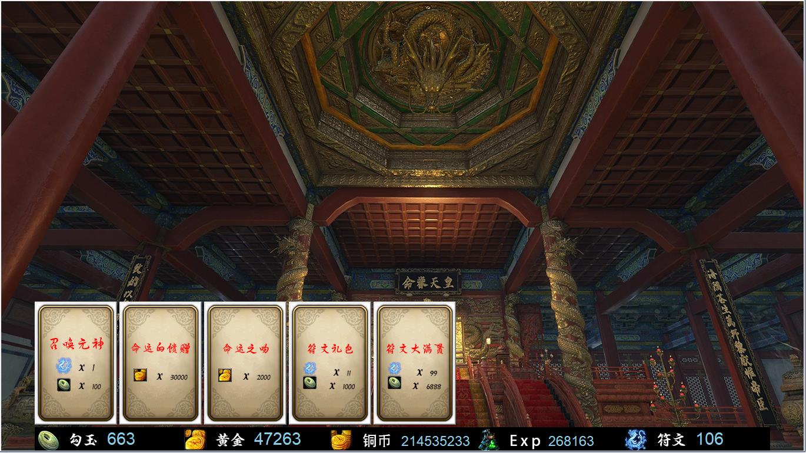
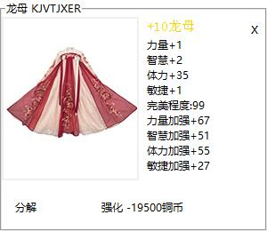
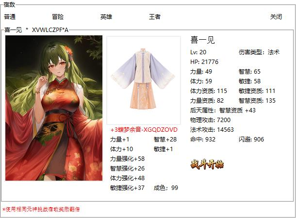
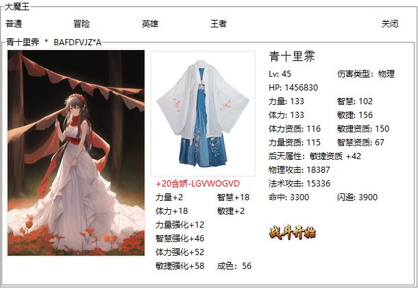

### 二次元卡牌养成回合制游戏

基于Python3.8.10开发，只使用了一个第三方库用作图片处理，Python初学者可以更好的了解Python的基础语法
GUI使用Python自带的tkinter库编写，拥有良好的跨平台兼容性，在Windows和Debian已完成测试。

#### 随机性：

为还原回合制游戏特色，角色部分属性、装备部分属性、APC属性大部分均随机，遇到挑战失败的副本可以多挑战几次。

#### 已实现功能：

抽卡

角色升级

角色分解

装备升级

装备分解

下副本

游戏存档

抽卡自动存档

内置修改器

复杂伤害计算公式

复杂副本机制实现

#### 伤害计算公式：

##### 命中率

命中基数为：我的.命中/敌人.闪避-1
为负数时为0
大于3只取3

#### 共计类型：

##### 物理攻击

物理攻击始终拥有10%强制命中率,且命中率增幅10%

##### 法术攻击

法术攻击伤害加10%

##### 混合攻击

两种指数相加x0.5+10% x 命中基数

##### 血怒共计

自身HPx0.1x（命中基数+1）

##### 法术穿透

法术攻击x0.1x命中基数+法术攻击x0.1 ~ 法术攻击x0.33

##### 诅咒

敌人HPx0.001 x 命中基数

#### 阵容积分：

阵容积分会影响收益，出战低等级卡牌会提高收益并获得HP恢复，出战高品级卡牌会降低收益
 

#### 装备系统设计思路：

##### 装备等级共6级:

传承-史诗-神器-稀有
黄-红-紫-蓝

准备总属性资质=200-180-160-120
随机属性资质=50-45-40-30
剩余固定属性 = 150-135-120-90

固定属性固定分配到一至三个属性上
剩余属性随机分配到4个属性上，第一次每次分配40%，第二次分配40%，第三次分配剩余属性的60%，第四条属性等于剩余的50%

##### 装备强化:

强化每级提升5%，强化花费=当前等级x1000+1000金币金币
强化成功率=100-(当前等级*4.8)

#### 副本介绍：

##### 宿敌：

单角色PK，使用相同的角色收益翻倍，难度低

##### 斗技：

我方出1-5个角色挑战敌方5个角色，难度低

##### 大魔王：

我方出1-5个角色挑战，HP值很高的BOSS，难度适中

##### 莉莉崽：

共计9个难度，按顺序通过前8个可开启隐藏关卡，难度高

##### 花朝节：

共计12个难度，各有特色，需要搭配不同的卡牌组合去挑战

